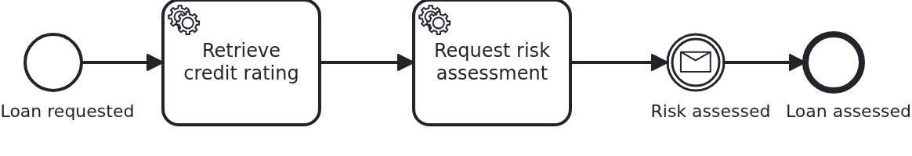
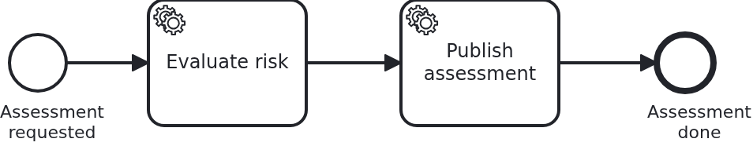

# Two workflow modules talking to each other

[](./LICENSE)

Two use cases need each other: one asks, the other answers, and both are workflow modules
with a process of their own. The tempting shortcut is to let the two processes exchange
messages directly. This blueprint does not, and the reason is the whole point: BPMN models
which know each other are two halves of one process, deployed as if they were independent.

What crosses the border instead is an interface and an event, both in a JAR of their own. A
delta on top of [`module-multi`](https://github.com/vanillabp-blueprints/module-multi-springboot),
whose conventions - a module wiring itself, bean names per module, identifiers kept apart in
the BPMS - are used here unchanged and not explained again.

## What this blueprint shows





A loan approval which cannot decide on its own: it needs the verdict of the risk assessment,
which is a use case of its own with a process of its own. The loan approval asks, carries on
with its own work, and waits at a message event; the risk assessment does what it was asked,
announces the result and is done.

### The border between the two modules

`banking-api` is the whole contract, and it holds two files:

```java
public interface RiskAssessments {
  void requestAssessment(String caseId, int amount);
}

public record RiskAssessed(String caseId, int score) {}
```

- **The request is a method call.** The asking module compiles against the interface, the
  answering module implements it, and neither of them names the other. What the answering
  module does with the request - a process, a table, a call to a rating agency - is not part
  of the contract.
- **The answer is an event.** It has to be: a module which delivered its answer by calling
  back would know its callers, and could no longer be deployed without them. So it announces,
  and whoever waits listens.
- **No BPMN, no aggregate, no `ProcessService` crosses.** The case id does, as a string. That
  is the same list `module-multi` gives for shared code, and here it is the border itself.

### How the processes learn about it

Neither model knows the other module:

- The loan approval has an ordinary service task *Request risk assessment*. Its handler calls
  the interface. That the call leaves the module is not modelled, and must not be.
- Then it waits at a message event *RiskAssessed*. Which module causes that message is not
  modelled either.
- The risk assessment has a service task *Publish assessment*, and that is where its answer
  leaves the module. Modelling it as a task rather than hiding it in a callback means the
  model shows where the module speaks.

The bridge between the event and the waiting process is one class, `RiskAssessedListener`: it
takes the event and calls the business code, which correlates the message. It is a driving
adapter, exactly like the REST controller next to it, and it exists so that the answering
module needs no knowledge of the waiting one.

### What comes from `module-multi` unchanged

Everything about having two workflow modules at all is that blueprint's subject and is not
repeated here: each module brings an auto-configuration and wires itself, names its beans
`<module-id>_<SimpleName>`, keeps its resources below a directory of its own, and the
application sets `name-clash-avoidance: use-prefix` so the two modules cannot collide inside
the engine. What is new here is only the border between them.

## Delta to the base blueprint

Compared to [`module-multi`](https://github.com/vanillabp-blueprints/module-multi-springboot),
whose two modules know nothing of each other:

|                        File                         |                                                                  What is different                                                                  |
|-----------------------------------------------------|-----------------------------------------------------------------------------------------------------------------------------------------------------|
| `banking-api/.../RiskAssessments.java`              | new: the interface one module offers the other, the request half of the contract                                                                    |
| `banking-api/.../RiskAssessed.java`                 | new: the event carrying the answer, because the answering module must not know its callers                                                          |
| `risk-assessment/`                                  | the second module answers instead of minding its own business: its `Service` implements the interface and publishes the event                       |
| `.../loanapproval/RiskAssessedListener.java`        | new: where the event enters the asking module and becomes a correlated message                                                                      |
| `.../loanapproval/Service.java`                     | asks the other module through the interface, and takes its answer onto the aggregate                                                                |
| `loan-approval/.../loan_approval.bpmn`              | a service task asking, and a message event waiting for the answer                                                                                   |
| `risk-assessment/.../risk_assessment.bpmn`          | a service task doing the work, and one publishing the result                                                                                        |
| `loan-approval/src/test/.../LoanApprovalIT.java`    | stands the other module in with a stub, which is all it takes                                                                                       |
| `application/src/test/.../ModuleInteractionIT.java` | new: both modules in one application, and the answer arriving at the waiting process                                                                |
| `application/pom.xml`                               | the profiles are set for every test of the module, because two application contexts in one JVM mean two embedded engines competing for one database |

Everything else is `module-multi`: the auto-configurations, the bean naming, the module
configuration per environment, the way the BPMS is chosen.

## Running it

Requires a JDK 21. Camunda 7 is embedded, so nothing else has to run:

```bash
mvn install verify
```

Running it on another BPMS is a Maven profile, not one line of Java changes:

```bash
mvn install verify -Pcamunda8
```

Camunda 8 is a remote engine, so a cluster has to run; its address lives in
`application/src/main/resources/application-camunda8.yaml`, with a copy for each module's own
test.

Start the application:

```bash
mvn -pl application spring-boot:run
```

One URL starts something, and it is the only one:

```
http://localhost:8080/api/loan-approval/start?amount=6000
```

The risk assessment has no start endpoint on purpose. It is asked by the other module, and a
second way in would invite exactly the shortcut this blueprint argues against. What it did
can be looked at, under the same id:

```
http://localhost:8080/api/risk-assessment/{id}
```

The log shows the whole interaction, and the order in it is worth reading:

```
Loan approval '0f7c…' started
Credit rating of loan approval '0f7c…' is 60
Risk assessment requested for loan approval '0f7c…'
Risk assessment of case '0f7c…' started
Risk score of case '0f7c…' is 30
Risk assessment of case '0f7c…' published
Loan approval '0f7c…' knows its risk score: 30
```

Two processes, two aggregates, and between them one method call and one event.

While the application runs on Camunda 7, Camunda's own web applications are served at
`http://localhost:8080/camunda`, user `demo` / `demo`. Cockpit shows the two processes side
by side and, between them, nothing: no message flow, no call activity, no relation the engine
knows about. Their names carry the prefix of their module there, as `module-multi` explains.

## How it works

|                               File                                |                                                 Role                                                 |
|-------------------------------------------------------------------|------------------------------------------------------------------------------------------------------|
| `banking-api/.../RiskAssessments.java`                            | the interface the asking module compiles against and the answering module implements                 |
| `banking-api/.../RiskAssessed.java`                               | the event carrying the answer back                                                                   |
| `.../loanapproval/Service.java`                                   | asks through the interface, and puts the answer onto its own aggregate                               |
| `.../loanapproval/RiskAssessedListener.java`                      | takes the event and hands it to the business code, which correlates the message                      |
| `.../loanapproval/Workflow.java`                                  | correlates `RiskAssessed`; the only class using `ProcessService` in this module                      |
| `loan-approval/.../processes/<adapter-id>/loan_approval.bpmn`     | asks in a service task, waits in a message event, and names neither the other module nor its process |
| `.../riskassessment/Service.java`                                 | implements the interface, runs its own process, publishes the result                                 |
| `risk-assessment/.../processes/<adapter-id>/risk_assessment.bpmn` | does the work, then publishes: the answer leaves the module at a task the model shows                |
| `application/src/test/.../ModuleInteractionIT.java`               | both modules in one application: the answer reaches the waiting process                              |
| `loan-approval/src/test/.../LoanApprovalIT.java`                  | the asking module alone, with the other one stood in for by a stub                                   |
| `risk-assessment/src/test/.../RiskAssessmentIT.java`              | the answering module alone, called exactly as the other module calls it                              |

The order of events: the loan approval's process reaches *Request risk assessment*, its
handler calls `RiskAssessments#requestAssessment`, and that call ends in the other module,
which starts a process of its own. The first process moves on to its message event and stops
there. Later - a transaction later, a thread later, on a remote engine possibly a second
later - the second process finishes, publishes `RiskAssessed`, and the listener of the first
module turns that into `correlateMessage`. The waiting process continues, with the score on
its own aggregate.

Two things are worth noticing about that sequence. The answer arrives **after** the asking
task has committed, which is what makes it safe: a module which answered inside the call
would correlate a message for a process which has not reached its waiting point yet. And
nothing in either BPMN model says any of this - remodel one process, and the other one does
not notice.

**What this blueprint deliberately does not show:** the same interaction with an asynchronous
service task instead of a message event. The asking process would then stay in the task and
be completed through `ProcessService#completeTask` when the answer arrives, which is what
[`bpmn-async-task`](https://github.com/vanillabp-blueprints/bpmn-async-task-springboot)
covers. The border between the modules would be the same interface and the same event; only
the way the waiting is modelled changes.

## Documentation

- [Workflow modules](https://github.com/vanillabp/adapter-platform-integration/wiki/Workflow-modules): what a workflow module is, its ID, and where its BPMN files are looked for
- [Defining a workflow module](https://github.com/vanillabp/adapter-platform-integration/wiki/Workflow-modules-in-Spring-Boot#defining-a-workflow-module): the marker file, the resource conventions and the module's own configuration files
- [Publishing a workflow module](https://github.com/vanillabp/adapter-platform-integration/wiki/Workflow-modules-in-Spring-Boot#publishing-a-workflow-module-it-brings-its-own-wiring): the auto-configuration recipe, the symptoms without it, and the names which collide once two modules meet
- [How name clashes are avoided](https://github.com/vanillabp/adapter-platform-integration/wiki/Workflow-modules#how-name-clashes-are-avoided): the three modes, and why changing the mode is a migration
- [Configuration of a workflow module](https://github.com/vanillabp/adapter-platform-integration/wiki/Workflow-modules#configuration): the file names, the profiles and the priority order
- [Workflow aggregates](https://github.com/vanillabp/adapter-platform-integration/wiki/Workflow-aggregates): why there are no process variables
- the wiki of the [BPMS adapter](https://github.com/vanillabp/adapter-platform-integration/wiki/BPMS-adapters) you use: how a BPMN task has to be modelled for that engine

This blueprint is developed in the monorepo
[`blueprints`](https://github.com/vanillabp-blueprints/blueprints). This repository is a
read-only mirror, **issues and pull requests belong there.**

## Noteworthy & Contributors

[VanillaBP](https://www.github.com/vanillabp/spi-for-java) was developed by [Phactum](https://www.phactum.at) with the
intention of giving back to the community as it has benefited the community in the past.


## License

Copyright 2026 Phactum Softwareentwicklung GmbH

Licensed under the Apache License, Version 2.0

        https://www.apache.org/licenses/LICENSE-2.0

Unless required by applicable law or agreed to in writing, software distributed under the
License is distributed on an "AS IS" BASIS, WITHOUT WARRANTIES OR CONDITIONS OF ANY KIND,
either express or implied. See the License for the specific language governing permissions
and limitations under the License.
